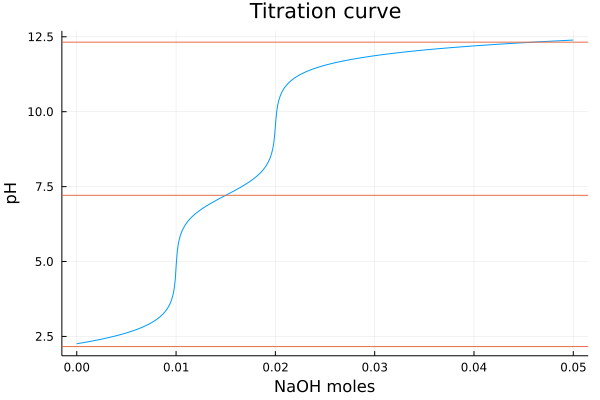

# pHcalc.jl

[](https://tp2750.github.io/pHcalc.jl/stable)
[](https://tp2750.github.io/pHcalc.jl/dev)
[](https://github.com/tp2750/pHcalc.jl/actions/workflows/CI.yml?query=branch%3Amain)
[](https://codecov.io/gh/tp2750/pHcalc.jl)

This is a Julia port of the Python library [pHcalc](https://github.com/rnelsonchem/pHcalc) by Ryan Nelson.

# Installation

As this is currently not registered, it is installed like this:

```julia
julia> using Pkg
julia> Pkg.add(url="git@github.com:tp2750/pHcalc.jl.git")
```

# Examples

The following examples are based on examples in the README from the [pHcalc python package](https://github.com/rnelsonchem/pHcalc) by Ryan Nelson.

The basic interface is the function `acid`:

* `acid(concentration)`: a strong acid as HCl, fully de-protonated at all pH. The `concentration` is in M
* `acid(concentration, pKa; charge=0)`: a weak acid given with one or more pKa values. The `charge` is the charge of the fully protonated form.
* `acid(; concentration, pKa=missing; charge=0)`: all parameters can be specified as keyword parameters.

Similarly, there is a `base` function, which is just an alias of the `acid` function with pKb = 14-pKa.
See examples below.

## pH of HCl and NaOH

The strong acids and bases are modeled just by the `acid` and `base` functions, where the only parameter is the molar concentration.

### 0.01 M HCl, 1E-8 M HCl

A solution with a concentration of 1E-2 M HCl has a pH of 2, and one with a concentration of 1E-8 M HCl has a concentration just below 7.

```julia
julia> using pHcalc
julia> pH(acid(0.01))
1.9999999999565705
julia> pH(acid(1E-8))
6.978294313542888
```

Similarly for NaOH:

```julia
julia> using pHcalc
julia> pH(base(1E-2))
12.00000000004343
julia> pH(base(1E-8))
7.021705686457112
```

## Titration of weak acid

### pH of 0.01 M HF
We model HF as an acid with pKa 3.17. 
First we compute the pH of 0.01 M HF, and next we titrate this with 0.01 M NaOH.
Note that here we assume that we add 0.01M NaOH without changing the concentration of HF.

```julia
julia> using pHcalc
julia> HF(concentration) = acid(concentration, 3.17)
julia> pH(HF(0.01))
2.6413038913220532
julia> pH([HF(0.01), base(0.01)])
7.59919839956255
```

## Polyprotic acids

### pH of 0.01 M H₂CO₃

Carbonic acid has 2 pKa values. 
The values used in by Ryan Nelson are: 6.3, 10.32.
This gives:


```julia
julia> using pHcalc
julia> pH(acid(0.01, [3.6, 10.32]))
2.834379584567423
```

[Other sources](https://chem.libretexts.org/Ancillary_Materials/Reference/Reference_Tables/Equilibrium_Constants/E1%3A_Acid_Dissociation_Constants_at_25C) claim the pKa values to be: 6.35, 10.33 leading to a different pH value:

```julia
julia> using pHcalc
julia> pH(acid(0.01, [6.35, 10.33]))
4.176450491695669
```

which is consistent with the value given [here](https://www.aqion.de/site/ph-of-common-acids).

### pH of 0.01 M Alanine Zwitterion Form

As an example of an acid that is charged in the fully protonated form, we reproduce the Alanine Zwitterion example of the [pHcalc README](https://github.com/rnelsonchem/pHcalc/blob/master/README.rst):

```julia
julia> using pHcalc
julia> pH(acid(0.01, [2.35, 9.69], charge=1))
6.099154517095277
```

### pH of 0.01 M (NH₄)₃PO₄

As a more complex example, we reproduce the ammonium phosphate example of the [pHcalc README](https://github.com/rnelsonchem/pHcalc/blob/master/README.rst).

We used the pKa values of Phosphoric acid (H₃PO₄) [are](https://chem.libretexts.org/Ancillary_Materials/Reference/Reference_Tables/Equilibrium_Constants/E1%3A_Acid_Dissociation_Constants_at_25C): 2.16, 7.21, 12.32, and the pKb of ammonia [is](https://chem.libretexts.org/Ancillary_Materials/Reference/Reference_Tables/Equilibrium_Constants/E2._Base_Dissociation_Constants_at_25C) 4.75.

To model 0.01 M of (NH₄)₃PO₄ we take 0.01 M of H3PO4 and 0.03 M of NH4 with a charge of +1:


```julia
julia> using pHcalc
julia> pH([acid(0.01, [2.16, 7.21, 12.32]), base(0.03, 4.75, charge=1)])
8.959447419610122
```

## Titration curves

We can easily plot something similar to a titration curve. 
However, these are not very "chemical" as it assumes we change the concentration of the base without changing the concentration of the acid. In principle this can be done with solid NaOH.

Here we use 0.01 M of phosphoric acid as example:

```julia
julia> using pHcalc
julia> using Plots
julia> function titration_curve(pKa, charge, concentration; volume = 1., base_conc =  range(1E-8, stop=.05, length=500), title="Titration curve")
           titrant = acid(concentration, pKa, charge=charge)
           tit_curve = [pH([titrant, base(x/volume)]) for x in base_conc];
           p1 = plot(base_conc, tit_curve, xlabel="NaOH moles", ylabel = "pH", label="", title=title)
           hline!(pKa, label="")
           display(p1)
       end
julia> titration_curve([2.16, 7.21, 12.32], 0., 0.01)
```



# Comparison to python version

The examples above show that we get the same values as the python library.
Is it faster?

## Julia

```julia
julia> using pHcalc
julia> function tit_curve(pKa, charge, concentration; volume = 1., base_conc =  range(1E-8, stop=.05, length=500))
           titrant = acid(concentration, pKa, charge=charge)
           [pH([titrant, base(x/volume)]) for x in base_conc]
       end

julia> @time c1 = tit_curve([2.16, 7.21, 12.32], 0., 0.01);
  0.175207 seconds (1.10 M allocations: 47.210 MiB, 7.22% gc time)
```

## Python

```python
from pHcalc.pHcalc import Acid, Neutral, System
import numpy as np
import time
def tit_curve():
    na_moles = np.linspace(1e-8, 5.e-2, 500)
    sol_volume = 1. 
    phos = Acid(pKa=[2.16, 7.21, 12.32], charge=0, conc=1.e-1)
    phs = []
    for mol in na_moles:
        na = Neutral(charge=1, conc=mol/sol_volume)
        system = System(phos, na)
        system.pHsolve(guess_est=True)
        phs.append(system.pH)
    
    return na_moles, phs

start_time = time.time()
x1, y1 = tit_curve()
print("--- %s seconds ---" % (time.time() - start_time))
## --- 2.083081007003784 seconds ---
```

So the Julia version is about 12 times faster.

Does it matter? [Perhaps](https://github.com/rnelsonchem/pHcalc/issues/2).

# Phosphate buffer

We can quite acurately reproduce the pH values of Sørensen's phosphate buffer from [this table](https://microscopy.berkeley.edu/buffers-and-buffer-tables/) using pKa values adjusted for a 100 mM ionic strength:  [2.06486, 6.80506, 11.564674].

The phosphate buffer consists of a mix of the waek acid NaH2PO4 and it's conjugate base: Na2HPO4. We model these as phosphoric acid with a charge parameter given by the number of missing hydrogens:

* NaH2PO4(conc) = acid(conc, [2.065, 6.805, 11.565], charge=1)
* Na2HPO4(conc) = acid(conc, [2.065, 6.805, 11.565], charge=2)

As an example, to get a 100 mM buffer at pH 7, [the table](https://microscopy.berkeley.edu/buffers-and-buffer-tables/) says we should mix 39.0 mM NaH2PO4 and 61.0 mM Na2HPO4.
This gives:

```julia
pH([acid(0.039, [2.065, 6.805, 11.565], charge=1), acid(0.061, [2.065, 6.805, 11.565], charge=2)])
# 6.999236502941879
```

The recipe uses 200 mM stocks, and does a final 2X dilution. 
We can model that directly:

```julia
A = sample(acid(0.2, [2.065, 6.805, 11.565], charge=1), 0.039)
B = sample(acid(0.2, [2.065, 6.805, 11.565], charge=2), 0.061)
pH(dilute.(mix([A,B]),2))
# 6.999236502941879
```

# Correcting for ionic strength

We use the same method as in  [Clymer / Barton]( https://www.egr.msu.edu/~scb-group-web/buffers/buffers.html) to adjust for ionic strength.

In the case of phosphate, we get (at 25C):

```julia
julia> ioncorrection([2.148, 7.198, 12.375], strength=0.1)
3-element Vector{Float64}:
  2.0648590825585424
  6.805057825843171
 11.56467418465781
```
